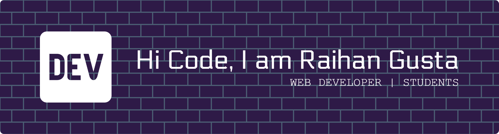

###

###

- I am an informatics engineering student.
- I am currently still learning about the Laravel framework.
- Coding is fun 😄

###

#### Code language

#### Touch me

#### Stats

####

<picture>
  <source media="(prefers-color-scheme: dark)" srcset="https://raw.githubusercontent.com/Doxx97/Doxx97/output/pacman-contribution-graph-dark.svg">
  <source media="(prefers-color-scheme: light)" srcset="https://raw.githubusercontent.com/Doxx97/Doxx97/output/pacman-contribution-graph.svg">
  
</picture>
